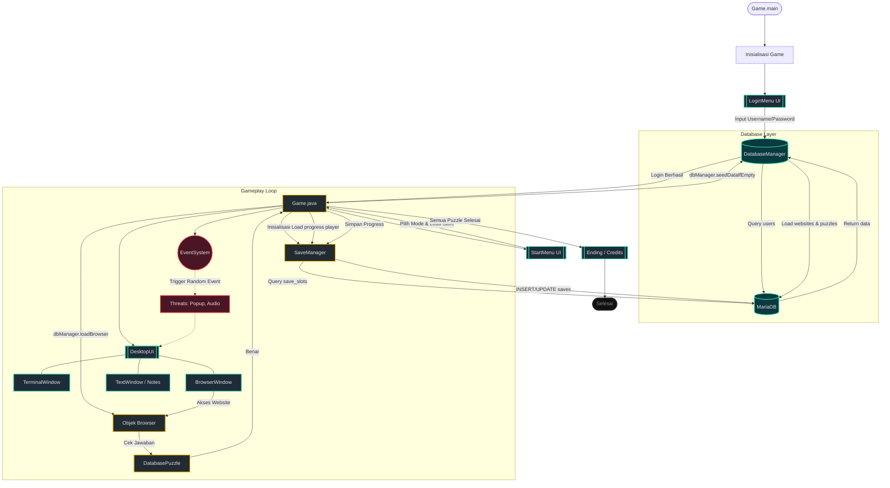

# Flowchart Arsitektur Phis in the Dark

Berikut adalah diagram alir (flowchart) yang menggambarkan bagaimana komponen-komponen di dalam game saling berinteraksi, mulai dari proses *boot*, integrasi database, hingga gameplay utama.

### Penjelasan Komponen:

1. **Titik Awal (Game.main)**: Game melakukan instansiasi terhadap `AudioManager` dan `DatabaseManager`, lalu membuka `LoginMenu`.
2. **Database Layer**: `DatabaseManager` memproses otentikasi login/register menggunakan hashing SHA-256 dan mencocokkan data di **MariaDB**.
3. **Pemuatan Data**: Setelah sukses login, game meminta `DatabaseManager` mengambil data puzzle dan struktur web, lalu merakitnya ke dalam virtual `Browser`.
4. **Start Menu**: Game menyuruh `SaveManager` membaca save data di database, lalu memberikan opsi ke player (Normal / Tutorial, New / Load).
5. **Gameplay (DesktopUI)**: Komponen utama di mana player menginvestigasi puzzle. Jika pemain menjawab *puzzle* dengan benar di browser, event dilempar ke `Game` untuk menyimpan progress melalui `SaveManager`.
6. **Event System**: Berjalan di *background thread* untuk menakut-nakuti pemain secara random ketika bermain di mode Normal (memunculkan jumpscare popup atau mengubah wallpaper).
