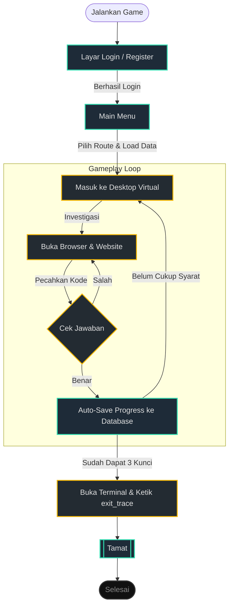

# Flowchart Alur Pemain (User Flow)

Ini adalah versi flowchart yang jauh lebih sederhana. Diagram ini hanya menampilkan sudut pandang perjalanan pemain (User Flow) saat memainkan Phis in the Dark, tanpa menampilkan kerumitan kode di belakang layar.

### Penjelasan Singkat:
1. **Layar Login**: Pemain mendaftarkan diri atau masuk ke akunnya.
2. **Main Menu**: Pemain memilih mode (Tutorial / Normal) dan memuat *save data*.
3. **Desktop Virtual**: Pemain melakukan eksplorasi dengan membaca petunjuk.
4. **Gameplay Loop**: Pemain mencoba menebak jawaban puzzle. Jika benar, progress akan otomatis tersimpan. Proses ini diulang sampai mendapatkan 3 kunci.
5. **Tamat**: Setelah kunci lengkap, pemain meretas keluar via Terminal untuk menyelesaikan game.
