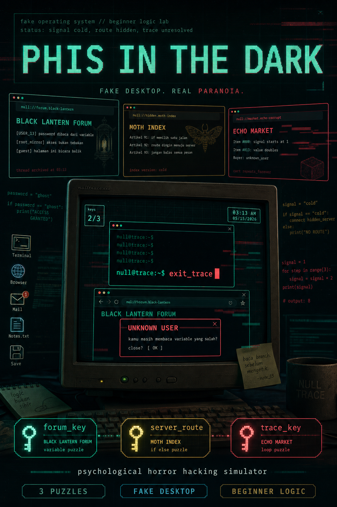
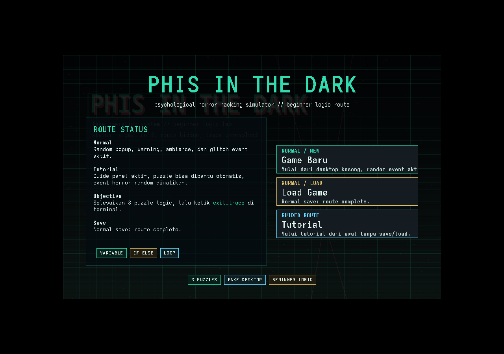

# LAPORAN PRAKTIKUM

# PHIS IN THE DARK

## Game Desktop Java Swing Bertema Psychological Horror Hacking Simulator

**Nama:** ........................................  
**NIM:** .........................................  
**Kelas:** .......................................  
**Mata Kuliah:** Pemrograman Berorientasi Objek / Praktikum Pemrograman  
**Tanggal:** 15 Mei 2026  

---

## Abstrak

Phis in the Dark adalah game desktop berbasis Java Swing yang menggabungkan konsep psychological horror, simulasi hacking, dan pembelajaran logika pemrograman dasar. Game ini menggunakan tampilan fake desktop yang berisi browser, terminal, notes, mail, settings, sistem save/load, popup ancaman, efek glitch, serta tiga puzzle utama. Puzzle yang digunakan melatih konsep variable, if else, dan loop. Pemain harus menyelesaikan tiga puzzle untuk memperoleh tiga key, yaitu `forum_key`, `server_route`, dan `trace_key`. Setelah semua key terkumpul, pemain dapat menyelesaikan permainan melalui command `exit_trace` pada terminal. Berdasarkan pengujian smoke test, seluruh website, asset utama, puzzle, aturan progres, dan validasi jawaban berjalan dengan status OK.

## BAB I PENDAHULUAN

### 1.1 Latar Belakang

Perkembangan game edukasi memberi peluang untuk menyampaikan materi pemrograman dengan cara yang lebih interaktif. Materi dasar seperti variable, percabangan, dan perulangan sering dianggap abstrak oleh pemula jika hanya disampaikan melalui teori. Oleh karena itu, dibuat sebuah prototype game desktop bernama Phis in the Dark yang membungkus latihan logika pemrograman ke dalam pengalaman investigasi digital.

Game ini tidak menampilkan horror dalam bentuk kekerasan visual, tetapi melalui atmosfer komputer yang terasa tidak stabil. Pemain berinteraksi dengan desktop palsu, browser beralamat `null://`, terminal, popup dari `UNKNOWN USER`, wallpaper corrupt, dan email progresif. Pendekatan ini membuat pembelajaran dasar pemrograman terasa seperti bagian dari alur cerita.

### 1.2 Rumusan Masalah

Rumusan masalah dalam praktikum ini adalah:

1. Bagaimana merancang game desktop Java Swing dengan konsep fake operating system.
2. Bagaimana menerapkan konsep OOP pada struktur game.
3. Bagaimana membuat puzzle edukatif yang melatih variable, if else, dan loop.
4. Bagaimana mengintegrasikan sistem progres, inventory key, save/load, event horror, dan ending.
5. Bagaimana melakukan pengujian dasar untuk memastikan data game dan progres berjalan benar.

### 1.3 Tujuan

Tujuan praktikum ini adalah:

1. Membuat playable prototype game desktop menggunakan Java Swing.
2. Menerapkan prinsip object-oriented programming pada class game, player, inventory, website, puzzle, UI, dan event.
3. Membuat alur permainan edukatif yang beginner friendly.
4. Menyediakan sistem save/load sederhana untuk menyimpan progres pemain.
5. Melakukan smoke test untuk memvalidasi asset, website, puzzle, dan aturan progres.

### 1.4 Batasan Masalah

Batasan proyek ini adalah:

1. Game dibuat sebagai desktop game lokal menggunakan Java Swing.
2. Asset visual dan audio dasar digenerate secara lokal.
3. Save/load masih menggunakan file lokal `~/.nulltrace/save.properties`.
4. Database multi user dan multi save slot masih berupa rancangan pada dokumen PRD.
5. Puzzle utama dibatasi menjadi tiga konsep dasar: variable, if else, dan loop.

## BAB II LANDASAN TEORI

### 2.1 Java Swing

Java Swing adalah toolkit GUI pada Java yang digunakan untuk membuat aplikasi desktop. Pada proyek ini Swing digunakan untuk membuat window utama, internal frame, button, text area, combo box, progress bar, popup, taskbar, dan tampilan fake desktop.

### 2.2 Object-Oriented Programming

Object-Oriented Programming adalah pendekatan pemrograman yang membagi program menjadi objek-objek dengan data dan perilaku masing-masing. Konsep yang digunakan pada proyek ini meliputi:

1. Encapsulation, diterapkan pada class `Player`, `Inventory`, `Website`, dan `Puzzle`.
2. Inheritance, diterapkan pada `BrowserWindow`, `TerminalWindow`, `TextWindow`, dan `ImageWindow` yang menggunakan dasar `BaseWindow`.
3. Polymorphism, diterapkan pada sistem threat melalui interface `Threat`.
4. Abstraction, diterapkan pada `Puzzle` dan `AbstractThreat`.
5. Interface, diterapkan pada `Solvable` dan `Threat`.

### 2.3 Game Loop dan Progression

Progression adalah urutan perkembangan pemain dalam game. Pada Phis in the Dark, progression dikendalikan oleh tiga puzzle utama. Pemain harus membuka website tertentu, membaca kode, menjawab puzzle, memperoleh item key, lalu membuka tahap berikutnya. Setelah tiga key didapatkan, terminal menerima command akhir `exit_trace`.

### 2.4 Puzzle Edukatif

Puzzle edukatif adalah tantangan yang dirancang untuk menguji pemahaman konsep tertentu. Pada game ini, puzzle tidak hanya menjadi hambatan permainan, tetapi juga media pembelajaran:

1. Variable Gate melatih pemahaman nilai variable dan comparison.
2. Cold Signal melatih pemahaman if else dan command yang aktif.
3. Signal Doubler melatih pemahaman loop dan perubahan nilai angka.

## BAB III ANALISIS DAN PERANCANGAN

### 3.1 Gambaran Umum Sistem

Phis in the Dark adalah prototype game desktop full Java Swing. Saat game dijalankan, pemain melihat start menu dengan pilihan Game Baru, Load Game, dan Tutorial. Setelah memilih mode, game menampilkan boot screen singkat, lalu masuk ke fake desktop.

Fake desktop berisi beberapa fitur utama:

1. Browser untuk membuka website misterius.
2. Terminal untuk menjalankan command.
3. Notes untuk melihat objective dan checklist key.
4. Mail untuk membaca pesan progresif.
5. Settings untuk audio, reset save, dan kembali ke menu utama.
6. Save dan Load untuk menyimpan atau memuat progres normal mode.

### 3.2 Struktur Folder

Struktur utama proyek adalah sebagai berikut:

```text
src/main/java/com/nulltrace/
  audio/      Audio manager
  core/       Game, GameMode, SaveManager
  events/     Random event dan threat
  player/     Player dan Inventory
  puzzle/     Puzzle coding beginner friendly
  ui/         Desktop Swing, browser, terminal, popup
  website/    Model browser dan website

assets/
  images/     PNG asset game
  sounds/     WAV asset game
  fonts/      Font terminal/retro
```

### 3.3 Alur Permainan

Alur permainan normal adalah:

1. Pemain memilih Game Baru atau Load Game.
2. Game masuk ke fake desktop.
3. Pemain membuka Browser.
4. Pemain menyelesaikan puzzle Black Lantern Forum untuk memperoleh `forum_key`.
5. Pemain menyelesaikan puzzle Moth Index untuk memperoleh `server_route`.
6. Pemain menyelesaikan puzzle Echo Market untuk memperoleh `trace_key`.
7. Pemain membuka Terminal.
8. Pemain mengetik `exit_trace`.
9. Game menampilkan ending dan menyimpan route sebagai archive.

### 3.4 Website Dalam Game

Browser menyediakan 10 website:

| No | Website | URL | Fungsi |
| --- | --- | --- | --- |
| 1 | Black Lantern Forum | `null://forum.black-lantern` | Puzzle Variable Gate |
| 2 | Moth Index | `null://hidden.moth-index` | Puzzle Cold Signal |
| 3 | Echo Market | `null://market.echo-corrupt` | Puzzle Signal Doubler |
| 4 | Encrypted Login | `null://gate.cold-login` | Halaman eksplorasi |
| 5 | Room 0x13 | `null://chat.room-013` | Halaman atmosfer |
| 6 | Broken Mirror | `null://mirror.corrupted` | Halaman glitch |
| 7 | Thirteen Notes | `null://blog.thirteen-notes` | Catatan belajar |
| 8 | Archive 404 | `null://gov.archive-404` | Arsip palsu |
| 9 | Wire Room | `null://forum.wire-room` | Forum teori |
| 10 | Null Search | `null://search.deep-null` | Search page |

### 3.5 Perancangan Puzzle

#### 3.5.1 Variable Gate

Puzzle pertama berada pada Black Lantern Forum.

```text
password = "ghost"

if password == "_____":
    print("ACCESS GRANTED")
```

Jawaban yang diterima adalah `ghost`. Setelah berhasil, pemain memperoleh `forum_key`.

#### 3.5.2 Cold Signal

Puzzle kedua berada pada Moth Index.

```text
signal = "cold"

if signal == "cold":
    connect hidden_server
else:
    print("NO ROUTE")
```

Jawaban yang diterima adalah `connect hidden_server`. Setelah berhasil, pemain memperoleh `server_route`.

#### 3.5.3 Signal Doubler

Puzzle ketiga berada pada Echo Market.

```text
signal = 1

for step in range(3):
    signal = signal * 2

print(signal)
```

Jawaban yang diterima adalah `8`. Setelah berhasil, pemain memperoleh `trace_key` dan command akhir `exit_trace` tersedia.

### 3.6 Perancangan Event Horror

Event horror dibuat ringan agar tidak mengganggu tujuan edukasi. Event yang tersedia adalah:

1. Popup `UNKNOWN USER`.
2. Browser glitch dengan pesan render warning.
3. Wallpaper corrupt sementara.
4. Hidden message berupa notifikasi sistem.

Pada mode Tutorial, event horror random dimatikan agar pemain baru dapat fokus memahami alur dan puzzle.

### 3.7 Perancangan Save dan Load

Save/load normal mode menyimpan data ke file lokal `~/.nulltrace/save.properties`. Data yang disimpan meliputi:

1. Nama player.
2. Puzzle yang sudah diselesaikan.
3. Inventory item.
4. Nilai paranoia.
5. Status ending.

Jika route sudah selesai, save dapat dibuka sebagai archive.

## BAB IV IMPLEMENTASI

### 4.1 Class Core

Class `Game` menjadi penghubung utama antara player, browser, audio manager, save manager, desktop UI, dan event system. Class ini juga mengatur start menu, boot screen, mode tutorial, penyelesaian puzzle, save/load, dan ending.

Class `SaveManager` bertanggung jawab menyimpan dan memuat progres pemain. Penyimpanan dilakukan menggunakan `Properties` sehingga sederhana dan mudah dibaca.

### 4.2 Class Player dan Inventory

Class `Player` menyimpan nama, inventory, daftar puzzle selesai, paranoia, dan status ending. Class `Inventory` menyimpan item yang diperoleh pemain, seperti `forum_key`, `server_route`, dan `trace_key`.

### 4.3 Class Website dan Browser

Class `Website` menyimpan data website, seperti id, title, url, visual style, subtitle, screenshot asset, body lines, puzzle, dan unlocked file. Class `Browser` menyimpan daftar website default dan history website yang dikunjungi.

### 4.4 Class Puzzle

Class abstrak `Puzzle` menjadi dasar untuk puzzle yang bisa diselesaikan. Subclass yang dibuat adalah:

1. `VariablePuzzle`.
2. `ConditionalPuzzle`.
3. `LoopPuzzle`.

Setiap puzzle memiliki id, title, concept, code block, instruction, tutorial answer, solved message, reward item, hint, dan validasi jawaban.

### 4.5 Class UI

Bagian UI berisi:

1. `StartMenu` untuk menu awal.
2. `DesktopUI` untuk fake desktop, taskbar, icon, notes, mail, settings, dan ending.
3. `BrowserWindow` untuk menampilkan website dan puzzle.
4. `TerminalWindow` untuk command seperti `help`, `browser`, `sites`, `status`, `decrypt`, dan `exit_trace`.
5. `PopupManager` untuk toast dan popup horror.
6. `BaseWindow`, `TextWindow`, dan `ImageWindow` sebagai window pendukung.

### 4.6 Asset

Asset proyek berada di folder `assets/`. Asset visual meliputi wallpaper desktop, terminal background, loading screen, popup warning, browser UI, glitch overlay, CRT overlay, icon desktop, dan screenshot website. Asset audio meliputi typing, notification, glitch, ambience loop, static noise, error, button click, dan creepy whisper.

## BAB V PENGUJIAN

### 5.1 Metode Pengujian

Pengujian dilakukan menggunakan smoke test non-UI melalui command:

```bash
java -cp out com.nulltrace.core.Game --smoke-test
```

Smoke test digunakan untuk memastikan:

1. Jumlah website sesuai.
2. Asset gambar utama dapat dibaca.
3. Asset suara tersedia.
4. Id website dan URL tidak duplikat.
5. Puzzle memiliki reward item.
6. Jawaban tutorial diterima.
7. Jawaban salah tidak diterima terlalu longgar.
8. Aturan unlock puzzle berjalan sesuai urutan.

### 5.2 Hasil Pengujian

Hasil pengujian terakhir:

```text
NullTrace smoke test
websites=10
site=black_lantern_forum, puzzle=puzzle_variable_gate
site=moth_index, puzzle=puzzle_hidden_server
site=echo_market, puzzle=puzzle_signal_doubler
site=cold_login, puzzle=exploration
site=room_013, puzzle=exploration
site=broken_mirror, puzzle=exploration
site=thirteen_notes, puzzle=exploration
site=archive_404, puzzle=exploration
site=wire_room, puzzle=exploration
site=null_search, puzzle=exploration
requiredPuzzles=3
status=OK
```

Berdasarkan hasil tersebut, data website, puzzle utama, asset, dan progression rules sudah berjalan dengan baik.

## BAB VI KESIMPULAN DAN SARAN

### 6.1 Kesimpulan

Berdasarkan hasil implementasi dan pengujian, dapat disimpulkan bahwa Phis in the Dark berhasil dibuat sebagai playable prototype game desktop Java Swing. Game ini menerapkan konsep OOP, menyediakan fake desktop, browser, terminal, puzzle edukatif, event horror ringan, save/load, tutorial mode, dan ending. Tiga puzzle utama berhasil melatih konsep variable, if else, dan loop dengan alur progression yang jelas.

Smoke test menunjukkan status OK, sehingga komponen dasar game dapat digunakan untuk demonstrasi praktikum.

### 6.2 Saran

Pengembangan selanjutnya dapat dilakukan dengan:

1. Melakukan manual check UI pada resolusi kecil dan normal.
2. Menambahkan reset current run di Settings.
3. Menambahkan toggle ambience terpisah dari mute semua audio.
4. Memperkuat variasi konten website dan puzzle.
5. Mengimplementasikan database, login, dan multi save slot sesuai PRD.
6. Menambahkan packaging final agar game lebih mudah dijalankan pengguna.

## Lampiran

### Poster Game



### Screenshot Runtime

Screenshot berikut diambil dengan menjalankan aplikasi Java Swing melalui virtual display `xvfb-run`. Tampilan ini menunjukkan start menu Phis in the Dark dengan pilihan Game Baru, Load Game, dan Tutorial.



### Ringkasan Fitur

1. Start menu dengan Game Baru, Load Game, dan Tutorial.
2. Fake desktop dengan taskbar dan icon aplikasi.
3. Browser dengan 10 website.
4. Terminal dengan command dasar.
5. Tiga puzzle logic.
6. Random threat pada normal mode.
7. Tutorial mode tanpa event horror random.
8. Save/load lokal.
9. Ending melalui command `exit_trace`.
